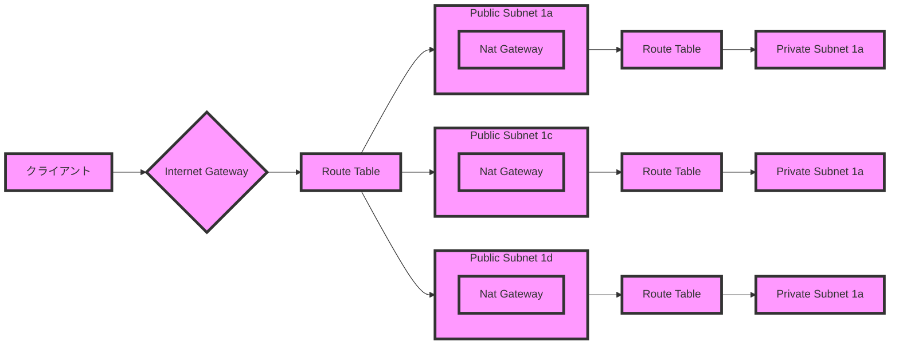

# 構成図



# コマンド
```
# 環境変数読み込み（これは一番最初に実行する）
# ~/.aws/credentialに登録していること
$ export AWS_PROFILE="satoken"

# 初期化
$ terraform init

# 検証
$ terraform plan

# 適用
$ terraform apply

# 削除
$ terraform destroy
```